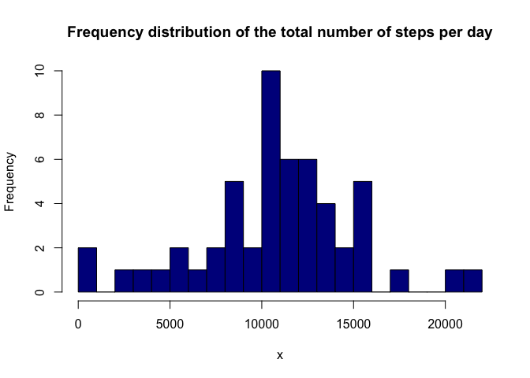
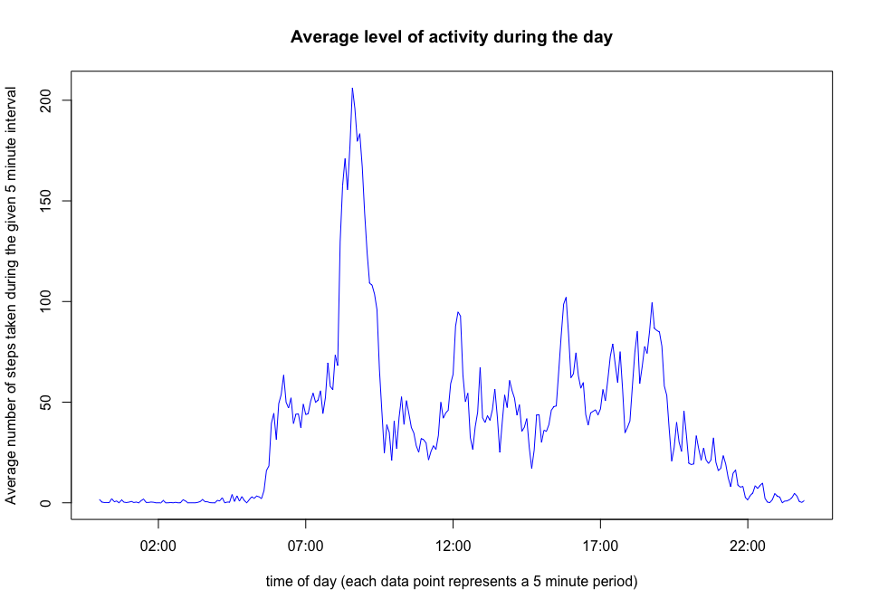
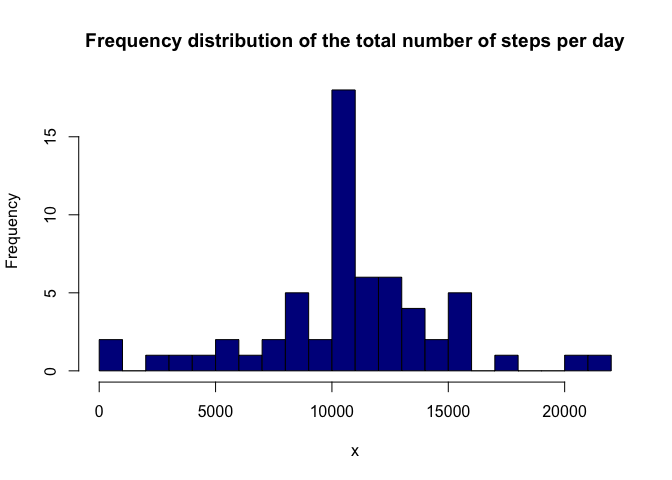

# Reproducible Research: Peer Assessment 1
`r Sys.Date()`  
## Documenting the current environment

I know this was not part of the template for this assignment, but Prof Peng 
mentions in the week 3 lectures that part of the Reproducible Research workflow 
is to document the environment that the analysis is run in (just in case there 
are issues that relate to a specific version).  

I have therefore put in this 
section to remind myself later how to do this...


```r
# first load the required libraries
library(dplyr)
```

```
## 
## Attaching package: 'dplyr'
```

```
## The following objects are masked from 'package:stats':
## 
##     filter, lag
```

```
## The following objects are masked from 'package:base':
## 
##     intersect, setdiff, setequal, union
```

```r
library(stringr)

# then generate the snapshot of the environment used
sessionInfo()
```

```
## R version 3.2.3 (2015-12-10)
## Platform: x86_64-apple-darwin13.4.0 (64-bit)
## Running under: OS X 10.10.5 (Yosemite)
## 
## locale:
## [1] en_AU.UTF-8/en_AU.UTF-8/en_AU.UTF-8/C/en_AU.UTF-8/en_AU.UTF-8
## 
## attached base packages:
## [1] stats     graphics  grDevices utils     datasets  methods   base     
## 
## other attached packages:
## [1] stringr_1.0.0 dplyr_0.4.3  
## 
## loaded via a namespace (and not attached):
##  [1] R6_2.1.1        assertthat_0.1  magrittr_1.5    formatR_1.2.1  
##  [5] parallel_3.2.3  DBI_0.3.1       tools_3.2.3     htmltools_0.3  
##  [9] yaml_2.1.13     Rcpp_0.12.3     stringi_1.0-1   rmarkdown_0.9.2
## [13] knitr_1.12.3    digest_0.6.9    evaluate_0.8
```

## Loading and preprocessing the data

Need to unzip the supplied file, read it into memory, and then clean up the
unzipped files.  The time interval is currently an integer, but actually seems 
to represent a time that, if padded with 0 to a width of 4, would be in the
format 'hhmm'.  I will therefore process the interval field into strings in the 
format 'hh:mm' which can more easily be converted into a time-value later.


```r
read_activity <- function() {
    unzip("activity.zip", exdir = "unzipped")
    activity <- read.csv("unzipped/activity.csv")
    file.remove(c(list.files(path = "unzipped", recursive = TRUE, full.names = TRUE),
                  "unzipped"))
    return(activity)
    }

format_as_time <- function(lst) {
    outval <- NULL
    for (x in lst) {
        outval <- c(outval,
                    x %>%
                        as.character %>%
                        str_pad(width=4,side="left",pad="0")
                    )
    }
    return(sub( '(?<=.{2})', ':', outval, perl=TRUE ))
}

activity <- read_activity()
activity$interval <- format_as_time(activity$interval)
```

## What is mean total number of steps taken per day?

There are a lot of NA's in the step count:

```r
str(activity)
```

```
## 'data.frame':	17568 obs. of  3 variables:
##  $ steps   : int  NA NA NA NA NA NA NA NA NA NA ...
##  $ date    : Factor w/ 61 levels "2012-10-01","2012-10-02",..: 1 1 1 1 1 1 1 1 1 1 ...
##  $ interval: chr  "00:00" "00:05" "00:10" "00:15" ...
```
I will therefore remove the NA's before calculating the daily total step count:

```r
day_totals <- function(activ) {
    return(activ %>% group_by(date) %>% na.omit %>% summarise(total = sum(steps)))
    }


daily_totals <- day_totals(activity)$total
```
This allows me to plot the required histogram:

```r
make_hist <- function(x) {
    hist(x, breaks=25L, col="dark blue", 
         main="Frequency distribution of the total number of steps per day")
    }


make_hist(daily_totals)
```



The mean number of steps per day is 10,766.19 steps.  

The median number of steps per day is 10,765 steps.  

## What is the average daily activity pattern?

In order to answer this part, the steps are fairly similar to the one above, 
except that I need to group by the interval, and summarise by taking the mean:


```r
activity_pattern <- activity %>% group_by(interval) %>% na.omit %>% summarise(average_steps = mean(steps))

plot(strptime(activity_pattern$interval, format = "%H:%M"), activity_pattern$average_steps, 
     type="l", col="blue",
     main="Average level of activity during the day",
     xlab="time of day (each data point represents a 5 minute period)",
     ylab="Average number of steps taken during the given 5 minute interval")
```




```r
# calculate the interval that has the maximum average number of steps
max_interval <- activity_pattern$interval[activity_pattern$average_steps==max(activity_pattern$average_steps)]
```

It looks like the most number of steps occur during the 5 minute interval starting at 08:35 hours.


## Inputing missing values

The activity data has 2304 rows that contain 'NA'.

For this part of the assignment, I will fill each 'NA' with the mean for that 
time period (as calculated in the previous section):


```r
replace_na <- function (activity) {
    for (i in 1:nrow(activity)) {
        if (is.na(activity$steps[i])) {
            intrvl <- activity$interval[i]
            activity$steps[i] <- activity_pattern$average_steps[activity_pattern$interval == intrvl]
            }
        }
    if (anyNA(activity$steps)) {
        return("There was a problem with replacing the NA values")
        } else {
            return(activity)
            }
    }

old_nr <- length(na.omit(activity))
old_mean <- mean(daily_totals)
old_median <- median(daily_totals)

activity2 <- (replace_na(activity))
daily_totals <- day_totals(activity2)$total
if (length(na.omit(activity2))==old_nr) {
    make_hist(daily_totals)
    } else {print("THERE WAS A PROBLEM")}
```



The mean number of steps per day is now 10,766.19 steps, compared to 10,766.19 when the NA values were ignored rather than filled in. 

The median number of steps per day is now 10,766.19 steps, compared to 10,765 when the NA values were ignored rather than filled in.  

So, as you can see, because I added values to the analysis that were the mean values
for each timeslot, there has been no change to the mean at all, and the median has been dragged closer to the mean.

## Are there differences in activity patterns between weekdays and weekends?

First I define a function for classifying a day of the week into either "weekend" ("Saturday" or "Sunday") or "weekday" (all other days):

```r
weekend_or_weekday <- function(day) {
    weekend.days <- c("Saturday", "Sunday")
    if (day %in% weekend.days) {
        return(as.factor("weekend"))
    } else {
        return(as.factor("weekday"))
    }
}
```

I can therefore now add a factor to the data that classifies the date as beeing either on a "weekend" or "weekday":


```r
day_or_end <- sapply(weekdays(as.Date(activity$date)), weekend_or_weekday , USE.NAMES = F)

activity3 <- cbind(activity, day_or_end)
activity_pattern3 <- activity3 %>% group_by(interval, day_or_end) %>% na.omit %>% summarise(average_steps = mean(steps))

activity_pattern3$interval <- sapply(strsplit(activity_pattern3$interval,":"),
  function(x) {
    x <- as.numeric(x)
    x[1]+x[2]/60
    }
)
```

This now allows me to plot the average activity profile on weekdays compared to weekends:


```r
library(lattice)

xyplot(average_steps ~ interval | day_or_end, data=activity_pattern3, type="l", layout=c(1,2), xlab = "Time interval (hours of the day)", ylab = "Average number of steps in each 5 min time interval")
```


